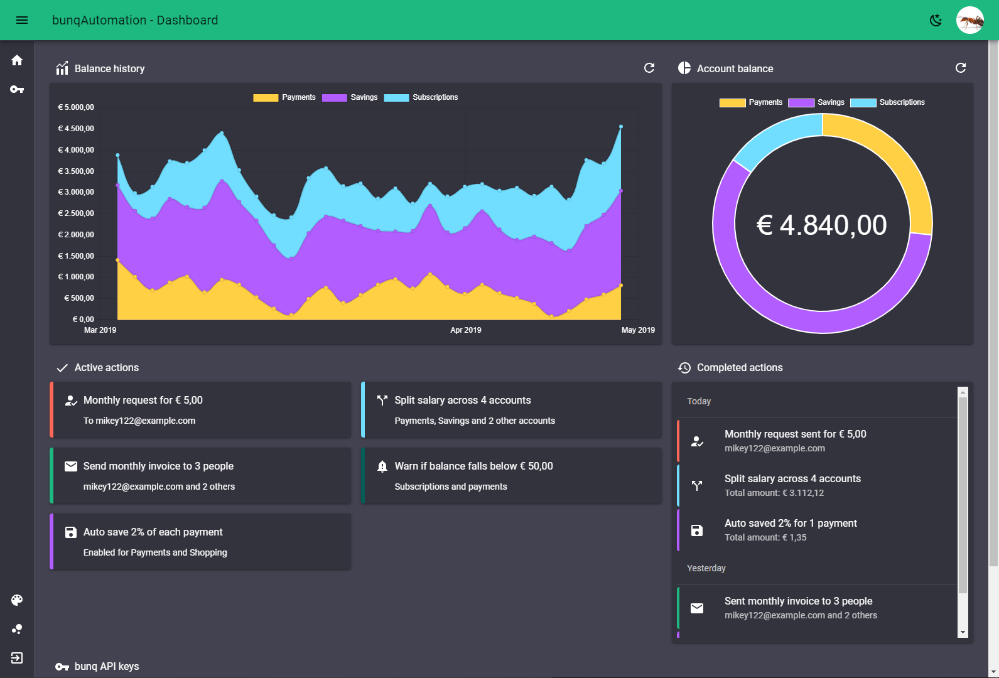

# bunqAutomation
This project should become a self hosted, easy to install and user friendly automation tool. Things such as automatically saving a percentage of each payment or automatically sending a request once a month (\*cough\* pack users \*cough\*) should be easy to setup.

Very much under development and NOT ready to be used for anything but sandbox testing!

Feel free to discuss things on [Telegram](https://t.me/bunqCommunity) or [create an issue](https://github.com/bunqCommunity/bunqAutomation/issues/new).

## Project goals

#### Selfhosted
Once the project is stable and useable work on creating one-click apps for popular hosting providers like DigitalOcean and Heroku.

#### Convention over configuration
Both using bunqAutomation and creating more modules/plugins later on should be simple.

#### Secure
Since this project should be useable for less experienced users, we can't guarantee that the servers will remain secure. Making sure no keys and passwords are stored in plain text is important.


## Planned features
 - Filter by account, amount, sender/receiver and any other event properties
 - Scheduled events like sending a request and emailing the monthly invoice
 - More extensive auto savings features such as a percentage of payment with optional maximum/minimum
 - Sharing events by link using a permanent or temporary link
 - Generate SSL certificates automatically using Letsencrypt to support HTTPS traffic
 - Security features like IP white listing
 - 2 factor authentication for logins and optionally to confirm "dangerous" change
 - Share events or certain config files by url with optional expiry date.

<!--## Docker usage-->

<!-- - Create a `bunq-automation` network .-->
<!-- -->
<!--```docker network create bunq-automation```-->

<!-- - Update the dependencies.-->
<!-- -->
<!--```docker-compose run --rm yarn``` -->

<!-- - For development run the following commands to start both the front-end build process and the back-end server in development mode with watch mode enabled.-->

<!--```docker-compose run --rm react```-->

<!--```docker-compose run --rm server```-->
<!-- -->
<!-- - For production build the server and client files.-->
<!--  -->
<!--```docker-compose run --rm yarn build```  -->

<!-- - Start the production server with the files that were built.-->

<!--```docker-compose up -d app```-->

## Development
Make sure you haven node 10 installed, or use `nvm use` to select the one from `.nvmrc`.

Start the front-end and back-end in development mode.
```
yarn run react
yarn run server
```
 
To run the server in production mode:
```
yarn run build
yarn run start
```
 
## Contact
[ ](https://t.me/bunqcommunity) 

We have a public [Telegram chat group ](https://t.me/bunqcommunity).

Feel free to create a new issue for any suggestions, bugs or general ideas you have on Github or 
contact us through one of the above.

## Screenshots
Based on test data and current designs and not functional yet.



## Contributors 

[](https://sourcerer.io/fame/crecket/bunqCommunity/bunqAutomation/links/0)[](https://sourcerer.io/fame/crecket/bunqCommunity/bunqAutomation/links/1)[](https://sourcerer.io/fame/crecket/bunqCommunity/bunqAutomation/links/2)[](https://sourcerer.io/fame/crecket/bunqCommunity/bunqAutomation/links/3)[](https://sourcerer.io/fame/crecket/bunqCommunity/bunqAutomation/links/4)[](https://sourcerer.io/fame/crecket/bunqCommunity/bunqAutomation/links/5)[](https://sourcerer.io/fame/crecket/bunqCommunity/bunqAutomation/links/6)[](https://sourcerer.io/fame/crecket/bunqCommunity/bunqAutomation/links/7)

## License
Unless otherwise noted, the bunqAutomation source files are distributed under the MIT License found in the [LICENSE](https://github.com/bunqCommunity/bunqAutomation/blob/master/LICENSE) file.

[](https://app.fossa.io/projects/git%2Bgithub.com%2FbunqCommunity%2FbunqAutomation?ref=badge_large)
